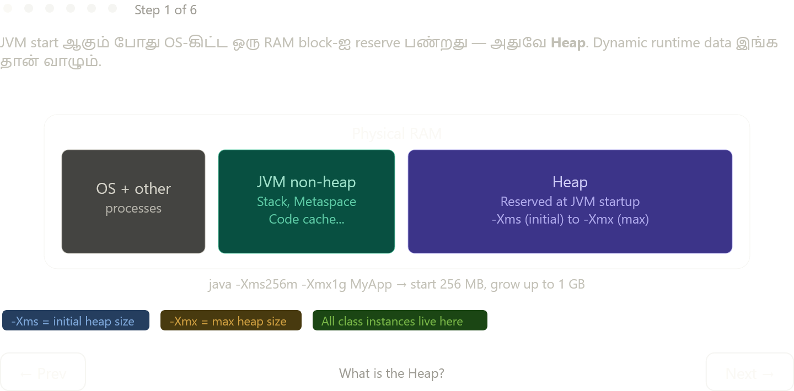

Heap-ஐ step-by-step பார்த்தோம் — இப்போ complete picture:

---

## Heap என்றால் என்ன?

JVM start ஆகும் போதே OS-கிட்ட ஒரு RAM block-ஐ "book" பண்றது — அதுவே Heap. `-Xms` flag initial size, `-Xmx` flag maximum size set பண்ணும். Application run ஆகும் வரை இந்த block JVM-க்கு exclusively reserved.

```bash
java -Xms256m -Xmx1g MyApp   # start: 256MB, max: 1GB
```

---

## Allocation — ஒரு object எப்படி Heap-ல் வருது?

`new` keyword எழுதும் போது JVM Heap-ல் space allocate பண்றது. Stack-ல் reference (address) மட்டும் store ஆகும், actual object data Heap-ல் இருக்கும்.

```java
Dog rex = new Dog("Rex");
//  ^^^                    Stack: variable 'rex', holds heap address
//          ^^^^^^^^^^^^   Heap:  actual Dog object with name="Rex"
```

---

## Heap Regions — ஏன் பிரிக்கப்பட்டு இருக்கு?

GC முழு Heap-ஐ scan பண்றது expensive. ஆனால் practically பார்த்தா **பெரும்பாலான objects short-lived** — ஒரு request process பண்ணி discard ஆகும். இந்த pattern-ஐ JVM utilize பண்றது:

**Young Generation** — புதிய objects இங்க வருது. Eden space full ஆனா Minor GC trigger ஆகும் — fast, only Young Gen scan. Alive objects → Survivor space-க்கு move ஆகும், age++ ஆகும்.

**Old Generation (Tenured)** — age threshold (default 15) cross பண்ணின objects இங்க promote ஆகும். Old Gen full ஆனா Major GC (Full GC) trigger ஆகும் — slow, Stop-the-World pause.

---

## Deallocation — GC எப்போது collect பண்றது?

Developer `free()` எழுத வேண்டாம். GC **reachability** பாக்கும் — ஒரு object-க்கு எந்த live reference-உம் இல்லாவிட்டா "unreachable" — GC collect பண்ணலாம்.

```java
Dog rex = new Dog("Rex");
rex = null;    // reference remove → Dog object unreachable
               // GC next run-ல் collect பண்ணும் (when? JVM decides)
```

`null` assign பண்றது GC-க்கு hint மட்டும் — guarantee இல்லை எப்போ collect ஆகும் என்று. JVM timing decide பண்ணும்.

---

## Java Memory Leak — இன்னும் possible!

C-ல் `free()` மறந்தா leak. Java-ல் reference remove பண்ண மறந்தா leak — mechanism வேற, result same. List-ல் objects add பண்ணிட்டே போனா, list live-ஆ இருக்கும் வரை எல்லா objects-உம் reachable → GC collect பண்ண முடியாது → Heap fills → `OutOfMemoryError: Java heap space`.

Chapter 3 & 4-ல் GC algorithms (Serial, Parallel, G1, ZGC) deeper-ஆ பார்ப்போம் — அது இந்த foundation-ஐ வைத்தே build ஆகும்.