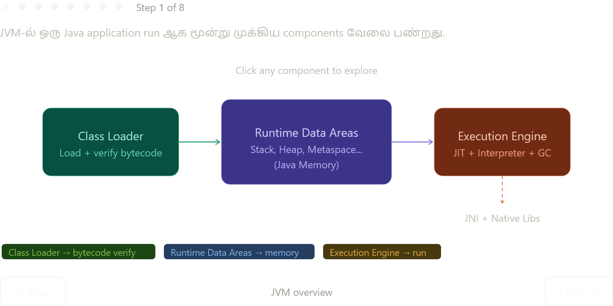

Stepper-ல் ஒவ்வொரு component-உம் explore பண்ணலாம். இப்போ full text explanation:

---

## JVM-ல் மூன்று Core Components

### 1. Class Loader

`.java` → `javac` compile → `.class` (bytecode). அந்த `.class` file-ஐ disk-ல் இருந்து எடுத்து JVM-க்கு load பண்றது Class Loader. இது மூன்று phase-ல் நடக்கும்: **Load** (file எடு) → **Link** (bytecode verify + resolve) → **Initialize** (static fields set). மூன்று loaders hierarchy-ல் வேலை பண்றது: Bootstrap → Extension → Application.

### 2. Runtime Data Areas — Java Memory

| Region | Per-thread / Shared | என்ன store ஆகும் |
|---|---|---|
| Stack | Per-thread | Method frames, primitives, references |
| Heap | Shared (all threads) | Objects, arrays |
| Metaspace | Shared | Class definitions, static vars, bytecode |
| PC Register | Per-thread | Current instruction address |
| Native Method Stack | Per-thread | JNI/C calls |
| Runtime Constant Pool | Metaspace-ல் part | String literals, numeric constants |

**Stack** — method call ஆகும் போது ஒரு frame push, return ஆகும் போது pop. Primitive values (`int`, `double`) நேரடியாக இங்க இருக்கும். Object references (Heap-க்கான address) இங்க இருக்கும், actual object Heap-ல் இருக்கும். Thread-safe — ஒவ்வொரு thread-க்கும் separate stack.

**Heap** — `new` keyword-ஆல் create ஆகும் எல்லா objects-உம் இங்க தான். GC இந்த region-ஐ மட்டும் manage பண்றது. Young Generation (Eden + Survivor) → Old Generation என்று sub-regions உண்டு — அதன் அடிப்படையில் Minor GC vs Major GC trigger ஆகும்.

**Metaspace** — Java 8-ல் PermGen-ஐ replace பண்ணது. `Dog` class-ஐ load பண்ணும் போது `Dog`-ன் structure (field list, method signatures, bytecode) இங்க வருது. Static variables (`static int count`) இங்க தான் — object-க்கு outside.

**PC Register** — CPU-ல் Instruction Pointer மாதிரி, JVM-ல் ஒவ்வொரு thread-க்கும் ஒரு PC Register. "இப்போ bytecode-ல் எந்த instruction execute பண்றோம்" என்று track பண்றது. CS:APP Chapter 3-ல் நீ படிக்கும் `%rip` register-க்கு exact analog.

### 3. Execution Engine

Bytecode-ஐ actually run பண்றது. ஆரம்பத்தில் **Interpreter** line-by-line execute பண்ணும் (slow). Same method 1000 times call ஆனா "hot code" என்று detect பண்ணி **JIT Compiler** அதை native machine code-ஆக compile பண்ணும் (fast). **GC** background-ல் Heap-ஐ monitor பண்ணி unreachable objects-ஐ collect பண்ணும் — C `free()`-ஐ developer manually எழுத வேண்டாம்.

இதுவே `malloc`/`free` vs Java GC-க்கு இடையே இருக்கும் fundamental difference — C-ல் developer responsibility, Java-ல் JVM responsibility.