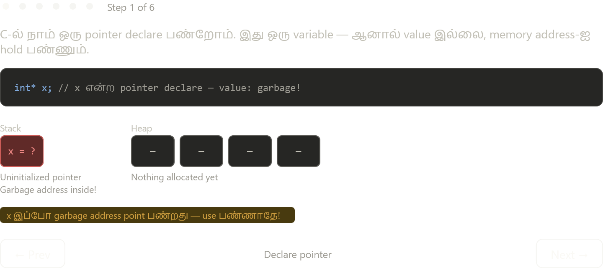

இப்போ C-ல் memory management எப்படி போகும் என்று interactive-ஆ step-by-step காட்டுறோம் — ஒவ்வொரு stage-லயும் என்ன நடக்குது, என்ன problem வருது.



Stepper-ல் ஒவ்வொரு step-உம் நடக்கும் போது memory-ல் என்ன ஆகுது என்று பார்க்கலாம். இப்போ complete picture:

---

## C Memory Management — என்ன நடக்குது?

### 1. `malloc()` — Manual Allocation

```c
int* x;                           // Stack-ல் pointer declare — garbage value
x = (int*) malloc(4 * sizeof(int)); // Heap-ல் 16 bytes reserve
                                  // return: base address → x-ல் store
```

`malloc` என்பது OS-கிட்ட "எனக்கு 16 bytes space தா" என்று கேக்குறது. OS space allocate பண்ணி starting address return பண்ணும். நாம் அதை `x`-ல் வைக்குறோம்.

### 2. `*x` vs `x` — Dereference Difference

```c
*x = 5;            // x-ல் இருக்கும் address-க்கு போய், அங்க 5 எழுது
printf("%d", *x);  // அந்த location-ல் இருக்கும் value-ஐ படி → 5

x = 5;             // WRONG! x-ஐ (pointer-ஐ) address 5-க்கு point பண்ணிட்டே
                   // ஐந்தாவது memory location — crash guaranteed
```

`*` operator-ஐ dereference operator என்று சொல்வார்கள். "Go to the address stored in this variable."

### 3. `free()` + `NULL` — Manual Deallocation

```c
free(x);   // Heap memory OS-க்கு திரும்ப கொடு
           // ஆனால் x-ல் இன்னும் 0x1000 இருக்கு — dangling pointer!

x = NULL;  // x-ஐ "invalid" என்று mark பண்ணு
           // இனி: if (x != NULL) { *x = ... } safe-ஆ check பண்ணலாம்
```

### 4. மூன்று Classic Bugs

| Bug | என்ன நடக்கும் | Java-ல் |
|---|---|---|
| Dangling pointer | `free()` கழிச்சு NULL set பண்ணல — freed memory use | GC manage பண்றது, developer free பண்ண வேண்டாம் |
| Memory leak | `malloc()` பண்ணி `free()` மறந்தா — memory forever blocked | Object reference இல்லாவிட்டா GC collect பண்ணும் |
| Boilerplate | Business logic-ஐ விட allocation code அதிகம் | `new` மட்டும் போதும், rest JVM handle பண்ணும் |

### 5. Java இதை எப்படி Fix பண்றது?

Java-ல் developer `free()` எழுத வேண்டாம். JVM-ல் இருக்கும் **Garbage Collector (GC)** background-ல் run ஆகும் — object-க்கு எந்த reference-உம் இல்லாவிட்டா தானா collect பண்ணும்.

```java
// Java-ல்:
Integer x = new Integer(5);  // Heap-ல் object create — GC track பண்றது
x = null;                    // Reference remove — GC next cycle-ல் collect பண்ணும்
// free() எழுத வேண்டாம்! Dangling pointer இல்லை!
```

இதுவே C/C++ vs Java memory safety-ல் core difference. நீ CS:APP படிக்கிற context-ல் இந்த pointer arithmetic பிறகு Chapter 6 (Memory Hierarchy) மற்றும் Chapter 9 (Virtual Memory)-ல் further deep-dive ஆகும் — malloc-ஐ kernel எப்படி implement பண்றது என்று பார்ப்போம்.