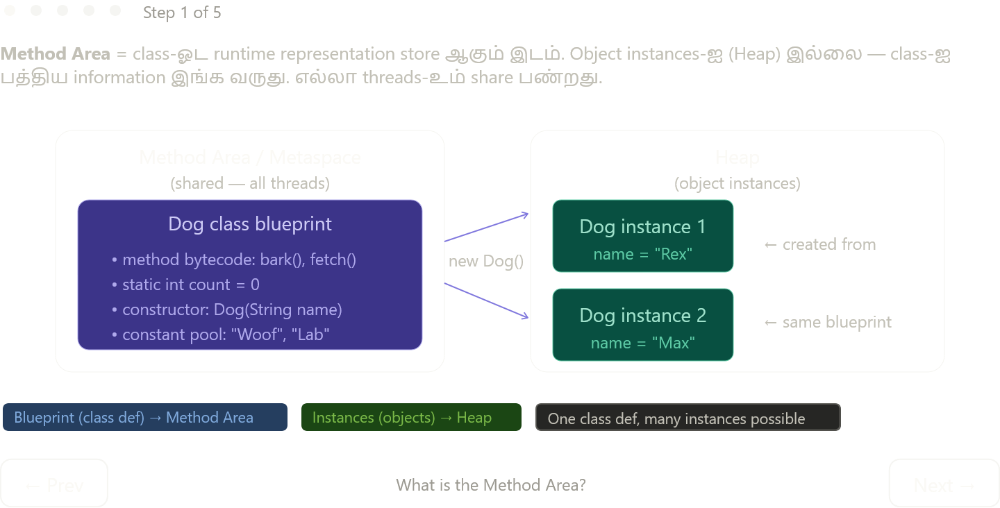

Complete text explanation:

---

## Method Area என்றால் என்ன?

**Class-ஓட runtime representation** store ஆகும் இடம். Object instances (Heap) இல்லை — class-ஐ பத்திய *information* இங்க வருது. Blueprint vs instance என்று நினைக்கலாம்: Dog class definition → Method Area, `new Dog("Rex")` → Heap.

எல்லா threads-உம் ஒரே Method Area-ஐ share பண்றது — Stack மாதிரி per-thread இல்லை.

---

## Method Area-ல் என்ன store ஆகும்?

```java
class Dog {
    static int count = 0;           // ① Static variable    → Method Area
    static final String SP = "C";   // ② Constant           → Runtime Constant Pool
    String name;                    // ③ Instance field      → Heap (per object)
    Dog(String n) { ... }           // ④ Constructor code   → Method Area
    void bark() { ... }             // ⑤ Method bytecode    → Method Area
}
```

நான்கு categories store ஆகும்: **runtime code** (method + constructor bytecode), **static variables**, **constant pool**, **class structure info** (field names, types, interfaces).

---

## Static variable — ஒரே ஒரு copy

`static int count` Method Area-ல் ஒரே ஒரு copy. 100 Dog objects create பண்ணாலும் count ஒரே location-ல் தான் இருக்கும். ஒரு object modify பண்ணினா எல்லாருக்கும் reflect ஆகும் — இதுவே `static`-ஓட core behavior.

```java
Dog d1 = new Dog("Rex");  // count = 1  (Method Area update)
Dog d2 = new Dog("Max");  // count = 2  (same location)
System.out.println(Dog.count); // 2
```

---

## PermGen → Metaspace (Java 8 change)

| | PermGen (Java ≤ 7) | Metaspace (Java 8+) |
|---|---|---|
| Memory | JVM Heap-க்கு inside | Native OS memory |
| Size | Fixed (`-XX:MaxPermSize`) | Auto-grows with RAM |
| Error | `OutOfMemoryError: PermGen space` | `OutOfMemoryError: Metaspace` (rare) |
| Problem | Large apps (many classes) → easily overflow | Mostly solved |

PermGen fixed size-ஆல் இருந்ததால் heavy frameworks (Spring, Hibernate) load பண்ணும் போது crash ஆவது common-ஆ இருந்தது. Metaspace native memory use பண்றதால் அந்த problem போச்சு — cap வேண்டும்னா `-XX:MaxMetaspaceSize` flag use பண்ணலாம்.

---

## மூன்று regions — complete picture

| Region | என்ன store ஆகும் | Shared? |
|---|---|---|
| **Stack** | Primitives, references, frames | Per-thread |
| **Heap** | Object instances, arrays | Shared |
| **Metaspace** | Class blueprints, static vars, bytecode | Shared |

PermGen vs Metaspace-ல் deeper differences (String interning behavior, GC handling) — அதை book-ல் பிறகு வரும், அப்போ இந்த base clear-ஆ இருக்கும்.