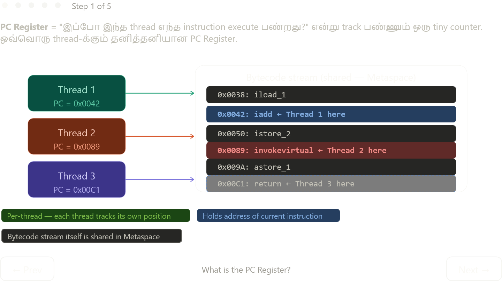

Complete explanation:

---

## PC Register என்றால் என்ன?

"இந்த thread இப்போ bytecode-ல் எந்த instruction execute பண்றது?" என்று track பண்ணும் ஒரு tiny counter. ஒரே ஒரு value store பண்றது — current instruction-ஓட address. ஒவ்வொரு instruction execute ஆகும் போது automatically update ஆகும்.

---

## ஏன் per-thread தேவை?

CPU-ல் multiple threads run ஆகும் போது **context switch** நடக்கும் — Thread 1 run பண்றது, pause, Thread 2 run பண்றது, pause, Thread 1 resume. Resume ஆகும் போது Thread 1 எங்க நின்றது என்று தெரிய வேண்டும். அதற்கு separate PC Register தேவை.

ஒரே ஒரு PC Register இருந்தால் — Thread 2 run ஆகும் போது அந்த value overwrite ஆகும், Thread 1 resume ஆகும் போது wrong instruction-ல் jump ஆகும் → crash / undefined behavior.

---

## PC Register vs Stack — இரண்டும் per-thread, ஆனால் different

| | PC Register | Stack |
|---|---|---|
| Store பண்றது | ஒரே ஒரு address value | Full method frames (locals, operand stack, return values) |
| Size | Tiny — few bytes | Grows/shrinks with call depth |
| Purpose | "எங்கு இருக்கோம்?" | "என்ன data வைத்திருக்கோம்?" |
| Updates | Every instruction | Every method call/return |

இரண்டும் per-thread — இரண்டும் threads-க்கு isolation கொடுக்குது, ஆனால் store பண்றது completely different.

---

## CS:APP Connection — நீ ஏற்கனவே இதை படிக்கிற!

CS:APP Chapter 3-ல் x86-64 architecture-ல் `%rip` (Instruction Pointer / Program Counter) என்று வரும். அதுவே CPU-level PC Register. JVM PC Register அதற்கு software-level analog:

```
Java source → javac → bytecode  →  JIT  →  x86 native code  →  CPU
                        ↑                           ↑
               JVM PC Register              %rip (CS:APP)
               tracks here                 tracks here
```

JVM ஒரு abstraction layer add பண்றது — bytecode-ல் JVM PC, native code-ல் CPU-ஓட `%rip`. Same concept, different levels.

---

## Complete Thread Memory Picture

**Per-thread (private):** Stack + PC Register + Native Method Stack — thread-safe by design, no synchronization needed.

**Shared (all threads):** Heap + Metaspace — race conditions possible here, `synchronized`/`volatile`/`AtomicInteger` போன்றவை தேவை.