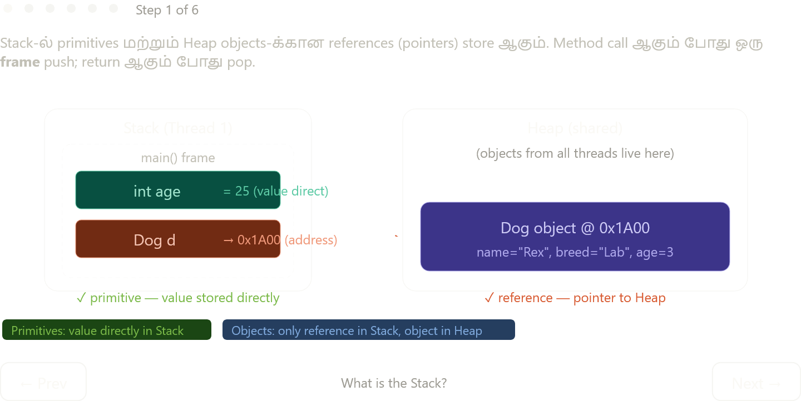

Complete explanation:

---

## JVM Stack — என்ன?

Stack-ல் இரண்டே விஷயங்கள் store ஆகும்: **primitives** (value directly) மற்றும் **Heap object-க்கான references** (address). Object data Stack-ல் வராது — அது Heap-ல் மட்டும் தான்.

---

## Frame — method call-ல் என்ன நடக்குது?

ஒவ்வொரு method call-க்கும் ஒரு **frame** push ஆகும். Frame-ல் மூன்று பகுதிகள்:

```
┌─────────────────────────────────┐
│  Local Variable Array           │  ← parameters, local vars
│  Operand Stack                  │  ← intermediate compute values
│  Return Value                   │  ← caller-க்கு திரும்ப pass
└─────────────────────────────────┘
```

Method return ஆனதும் frame **pop** ஆகும் — அந்த method-ல் இருந்த எல்லா local values-உம் automatically clean. Developer free() பண்ண வேண்டாம்.

---

## ஒரு Thread ஒரு Stack — Isolation

**ஒவ்வொரு thread-க்கும் completely separate Stack.** Thread 1-ஓட Stack-ஐ Thread 2 access பண்ண முடியாதே — "no links between stacks."

| Memory | Scope | Thread safe? |
|---|---|---|
| Stack | Per-thread (private) | ✅ Always safe |
| Heap | Shared (all threads) | ❌ Needs synchronization |

இது critically important — Stack variables race condition-க்கு expose ஆகாது, Heap shared objects-ல் தான் concurrency bugs வருது.

---

## Concurrency — Stack இதை எப்படி protect பண்றது?

Web server-ல் 100 users simultaneously request பண்ணினா — 100 threads, 100 stacks. ஒவ்வொரு thread-க்கும் அவரவர் `userId`, `sessionId` போன்ற local variables தனியாக இருக்கும். ஒருவர் மற்றவரை affect பண்ண முடியாது.

ஆனால் database connection pool, shared counter போன்ற Heap objects-ஐ எல்லா threads-உம் share பண்றதால் — `synchronized`, `AtomicInteger`, `volatile` போன்ற tools தேவைப்படும்.

---

## StackOverflowError — Stack-ல் ஒரே ஒரு error

Heap → `OutOfMemoryError`. Stack → `StackOverflowError`. Base case இல்லாத recursion-ல் frames keep pushing, Stack limit reach ஆகும். Fix: recursion-ல் base case, அல்லது deep recursion-ஐ iteration-ஆக convert பண்று.

---

**Key summary:** Stack = fast, automatic, per-thread, LIFO. Heap = shared, GC-managed, objects live here. Stack is where execution happens; Heap is where data lives.