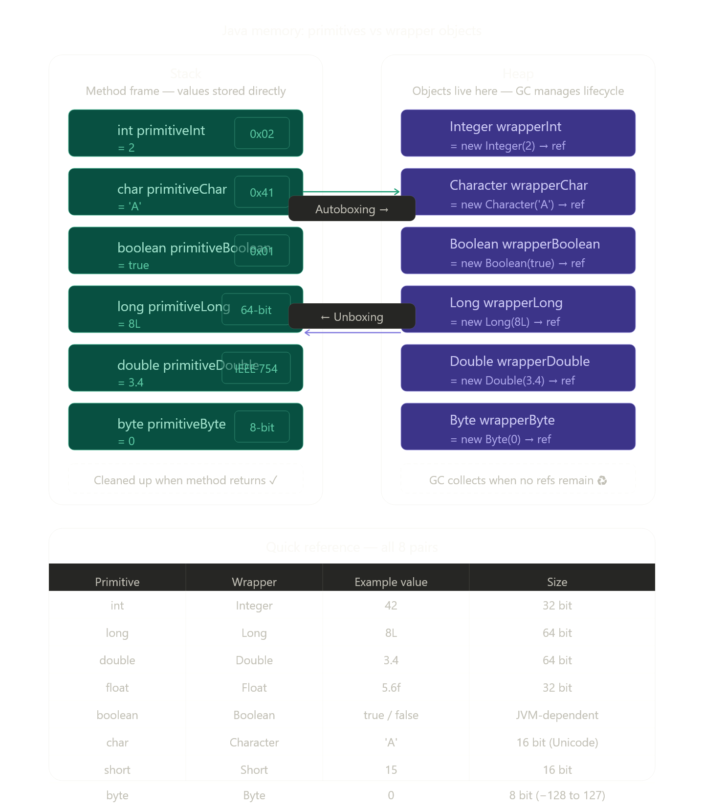

Java-la primitive vs wrapper class concept-ai visual-aaga explain panren, step-by-step flow-oda build panrom.Diagram-la clear-a theriyum — ipo concept-ai full-a explain pannrom.

   Java memory: primitives vs wrapper objects


---

## 1. Primitive என்றால் என்ன?

`int`, `char`, `boolean`, `double` போன்றவை **primitive types** — இவை raw values மட்டுமே store பண்ணும். இவற்றுக்கு object overhead இல்லை, எந்த method-உம் இல்லை. JVM நேரடியாக **Stack**-ல் value-ஐ வைக்கும்.

```java
int primitiveInt = 2;  // Stack-ல் நேரடியாக value "2" இருக்கும்
```

Method return ஆனதும் — stack frame clean ஆகும், value gone.

---

## 2. Wrapper Class என்றால் என்ன?

`Integer`, `Character`, `Boolean` என்பவை `java.lang` package-ல் இருக்கும் **full objects**. இவை **Heap**-ல் create ஆகும். Object என்பதால் இவற்றுக்கு methods இருக்கும்.

```java
Integer wrapperInt = 2; // Heap-ல் Integer object create ஆகும்
                         // Stack-ல் அந்த object-க்கான reference மட்டும் இருக்கும்
```

GC (Garbage Collector) reference இல்லாத போது Heap-ல் இருந்து அதை clean பண்ணும்.

---

## 3. Autoboxing & Unboxing (Java 5+)

`= 2` என்று நீ write பண்ணும் போது நீ `new Integer(2)` write பண்ணவில்லை — compiler தானா convert பண்ணும். அதை **Autoboxing** என்று சொல்வார்கள்.

```java
Integer wrapperInt = 2;         // Autoboxing   →  compiler: Integer.valueOf(2)
int back           = wrapperInt; // Unboxing     →  compiler: wrapperInt.intValue()
```

---

## 4. Wrapper ஏன் தேவை? Real Code Example

```java
import java.util.ArrayList;

public class WrapperDemo {
    public static void main(String[] args) {

        // ❌ ArrayList<int> — COMPILE ERROR!
        // Generics ஒரு primitive-ஐ accept பண்ணாது

        // ✅ ArrayList<Integer> — correct
        ArrayList<Integer> numbers = new ArrayList<>();
        numbers.add(10);   // Autoboxing: int 10 → Integer object
        numbers.add(20);
        numbers.add(30);

        int sum = 0;
        for (int n : numbers) {  // Unboxing: Integer → int, each iteration
            sum += n;
        }

        System.out.println("Sum: " + sum); // Sum: 60

        // Wrapper-ல் மட்டும் வரும் useful methods:
        System.out.println(Integer.MAX_VALUE);       // 2147483647
        System.out.println(Integer.toBinaryString(5)); // 101
        System.out.println(Integer.parseInt("42"));   // String → int convert
        System.out.println(Character.isDigit('9'));    // true
        System.out.println(Boolean.parseBoolean("true")); // true
    }
}
```

---

## 5. Null — Wrapper-ல் மட்டும் possible

```java
int x = null;       // ❌ Compile error — primitive null-ஐ hold பண்ண முடியாது
Integer y = null;   // ✅ Object என்பதால் null allowed
```

Database-ல் இருந்து ஒரு column-ல் value இல்லாம வரும் போது `Integer` வாடிக்கையாக use ஆகும் — `null` represent பண்ண.

---

## 6. Performance கவனிக்க வேண்டியது

| Situation | Use |
|---|---|
| Simple calculation, loop | `int`, `double` (primitive) — faster |
| Collections, Generics | `Integer`, `Double` (wrapper) — required |
| null possible | Wrapper only |
| API / JSON parsing | Wrapper (`Integer.parseInt()`, etc.) |

---

**Key takeaway:** Primitive = Stack-ல் raw value, fast, no methods. Wrapper = Heap-ல் object, GC managed, methods available, null possible. Compiler autoboxing-ஆல் இரண்டையும் freely mix பண்ணலாம் — ஆனால் heavy loop-ல் wrapper use பண்ணினா GC pressure கூடும், அதை தெரிஞ்சு இரு.

Diagram-ல் எந்த box-ஐயும் click பண்ணினா deeper question கேக்கலாம் 👆